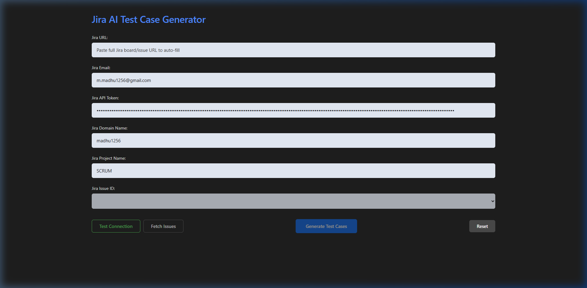
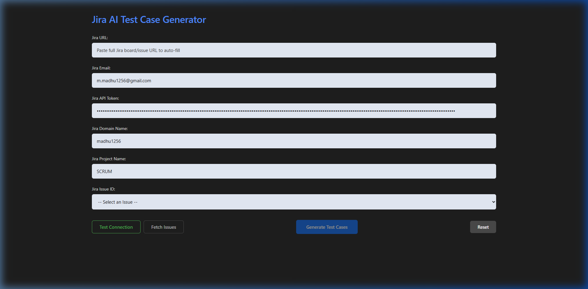
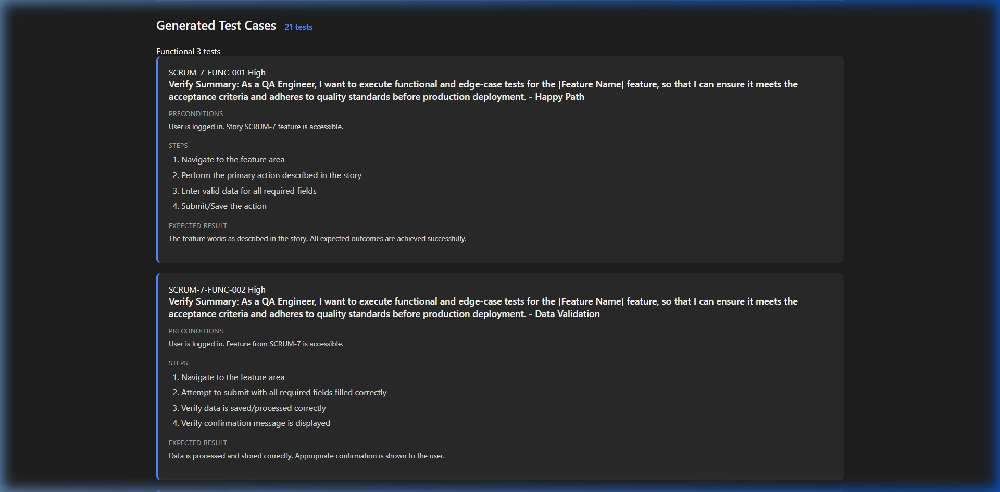

# Jira AI Test Case Generator

This application automatically fetches Jira user stories/issues and generates comprehensive test cases based on various testing methodologies (Functional, Negative, UI/UX, Performance, etc.). It features a sleek, dark-themed UI that automatically parses your Jira workspace details from a simple URL.

## Prerequisites

Before you run the application, make sure you have the following installed on your machine:
*   **Node.js**: [Download and Install Node.js](https://nodejs.org/) (Version 16 or higher recommended).
*   **Git**: To clone the repository (if applicable).

## Setup Instructions

1.  **Clone or Download the Repository:**
    Navigate to your desired folder in the terminal and clone the repo.
    ```bash
    git clone https://github.com/Madhu123123/AI_TestCaseGenerator_JIRA.git
    cd AI_TestCaseGenerator_JIRA
    ```
    *(If you downloaded the ZIP, extract it and open the `AI_TestCases` folder in your terminal).*

2.  **Install Dependencies:**
    Run the following command to download all required packages:
    ```bash
    npm install
    ```

## How to Run the Application

To start the local server and automatically launch the application in your browser, run:

```bash
npm start
```
*(Alternatively, you can run `npx ts-node src/launch.ts` or `npx ts-node src/server.ts`)*

The application will start a local server at **http://localhost:4200**.

## How to Use the Application

1.  **Open the App**: Once the server starts, go to `http://localhost:4200` in your web browser.
2.  **Enter Connection Details**:
    *   **Jira URL**: The easiest way to connect! Paste a full link to any of your Jira boards or issues (e.g., `https://domain.atlassian.net/jira/software/projects/KEY/boards/1`). The application will **automatically extract** and fill in your Domain Name and Project Name.
    *   **Jira Email**: Enter the email address associated with your Atlassian account.
    *   **Jira API Token**: Paste your Jira API Token. 
        *(To create one, go to your Atlassian Account Settings > Security > Create and manage API tokens).*
3.  **Test Connection (Optional)**: Click the **Test Connection** button (with the green outline) to instantly verify that your Email, Token, and Domain are correct. Look for the "Connection Test Successful!" toast at the top right.



4.  **Fetch Issues**: Click the **Fetch Issues** button. The application will connect to Jira and populate the "Jira Issue ID" dropdown with the latest issues (like user stories and bugs) from your specified project.
5.  **Select an Issue**: Choose a specific Jira ticket from the newly populated "Jira Issue ID" dropdown.



6.  **Generate Test Cases**: Click the blue **Generate Test Cases** button. The application will analyze the Jira issue and generate various test scenarios based on standard testing methodologies.
7.  **Review and Export**: Scroll down to view the generated test cases organized by category. You can also click **Export CSV** to download them to your computer.



### Configuration Auto-Save

Once you successfully fetch issues or test a connection, your credentials (Email, Token, Domain, Project) are automatically securely saved locally in the `config/jira-config.json` file. The next time you open the app, you won't need to retype them!
